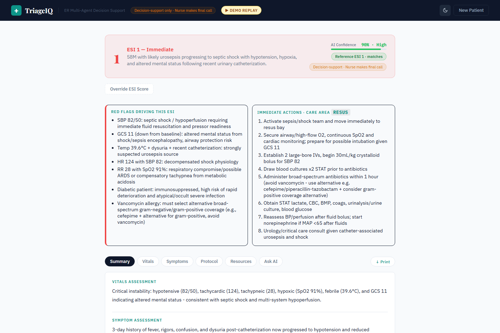

# TriageIQ, ER Triage Decision Support

[](./LICENSE)
[](./requirements.txt)
[](./config.py)
[](./.github/workflows/ci.yml)



*The recorded demo (`TRIAGEIQ_DEMO=1`, no API key) for mock patient PT-001. The banner shows the reference ESI next to the model's, and the nurse can override with a reason.*

An emergency-department triage decision-support system that turns a patient record into an ESI 1-5 classification, an explicit red-flag list, a care area and an action checklist, streamed to the nurse as the reasoning arrives. Version 2 is the **eval-driven rewrite**: the June 2026 eval showed the original four-specialist pipeline was no safer than a single Sonnet call and 20 points worse at assigning a care area, so v2 ships the lean shape the eval recommended (one Symptom specialist plus a Synthesizer), makes the care area and red flags explicit schema fields instead of prose, validates every report with a repair round, treats intake text as data, falls back to rubric rules when the model API is down, and traces cost per run.

> **Decision-support tool, the nurse makes the final call.** Mock patient data only, not clinically validated, not for use with real patients. See [Honest disclosure](#honest-disclosure).

**[Eval harness](./eval/README.md)** · **[Rubric](./eval/RUBRIC.md)**

---

## The clinical-safety frame (read this first)

TriageIQ is **decision support**, not diagnosis. The intended user is a triage nurse at the front of an ED waiting room who needs to assign an Emergency Severity Index (ESI 1 immediate → ESI 5 non-urgent) to incoming patients in seconds, while juggling a queue.

Three commitments hold the line:

1. **The nurse retains decision authority.** The ESI lands as a recommendation with the reasoning beside it. No auto-routing, no auto-summoning, no auto-anything; the UI has a nurse-override control that records the reason.
2. **The reasoning is shown, not hidden.** Red flags name the finding *and* the concern ("SBP 88 with chest pain: possible cardiogenic shock / MI"). Specialist output is a tab away.
3. **Degradation is visible.** If the model is unavailable the rules take over, the report says so in a banner, confidence is LOW, and the rules lean toward over-triage.

---

## What this proves (AI Engineer signals)

| Signal | Where it shows up |
|---|---|
| **Eval-driven simplification, negative result kept** | 30 scenarios × 2 branches × 3 reps (June 2026) showed critical-miss rate 0% on both architectures, care-area accuracy 74% vs 94% against the single call, and the only FULL advantage was red-flag coverage (+12.7pp). v2 keeps the Symptom specialist that produced that advantage and drops the rest; `TRIAGEIQ_PIPELINE=full` keeps the old shape for the A/B. |
| **Structured outputs with repair** | `generate_triage_report` is a strict tool schema: `esi_score`, `care_area` (enum), `red_flags[]`, `action_checklist[]`, `confidence`. Invalid input returns the error list to the model for one repair; failures are counted on the trace. [`backend/schemas.py`](./backend/schemas.py). |
| **Rule-based fallback that matches the rubric** | `backend/fallback.py` implements RUBRIC §1-4; a test asserts it derives the same ESI as `eval/rubric_audit.py` on all 30 scenarios. |
| **Untrusted intake text** | Patient name → opaque `PATIENT-xxxx` plus age/sex before any prompt; every field rendered inside tags with a data-not-instructions rule; instruction-like text is flagged as a red flag ("possible tampered intake note"), never obeyed. [`backend/sanitize.py`](./backend/sanitize.py). |
| **Observability and ceilings** | Per-run trace (calls, tokens, cache reads, USD, latency per stage), token and call ceilings that trigger the fallback, prompt caching, hash-chained audit log verified on `/health`. [`backend/telemetry.py`](./backend/telemetry.py). |
| **Tiered models, measured** | Specialists on Haiku 4.5, Synthesizer on Sonnet 5; the eval reports mean calls, cost and latency per branch. |
| **Tested without the network** | 257 tests: sanitiser, schema, fallback, telemetry, both pipelines on a scripted fake client (repair, degraded, ceilings, injection), the FastAPI surface and demo replay. CI runs lint, tests, the regression gate, the frontend build and a Docker smoke test. |

---

## System at a glance

```
   patient record (PT-xxx or free text + vitals)
                 ▼
   sanitise: name → PATIENT-xxxx · tag every field as data · flag instruction-like text
                 ▼
   ┌── lean (default) ─────────────┐   ┌── full (TRIAGEIQ_PIPELINE=full) ──────────────┐
   │ Symptom Classifier (Haiku)    │   │ Vitals · Symptom · Protocol · Bed (Haiku, ∥)  │
   └──────────────┬────────────────┘   └───────────────────────┬───────────────────────┘
                  └─────────────────────┬───────────────────────┘
                                        ▼
                     Synthesizer (Sonnet 5) → generate_triage_report (strict schema)
                       validation fails → errors back to the model, one repair
                                        ▼
        ESI · care_area · red_flags[] · action_checklist[] · confidence · rationale
                                        ▼
        SSE: status per agent · trace · complete   →   nurse dashboard, override, print, chat

   API error / ceiling  ──▶  rubric rules (backend/fallback.py): degraded=True, confidence LOW
```

---

## Honest disclosure

1. **Two evals; the second confirms the first and adds a wrinkle the first could not see.** The June 2026 run (30 scenarios × `full` + `stripped` × 3 reps) found critical-miss 0% on both, care-area 74% vs 94% against the single call, and red-flag coverage the only FULL win. The September 2026 run re-measures three branches on Sonnet 5: 30 scenarios × 3 branches × 3 reps = 270 runs, 267 scored (901 calls, $11.28). Report: `eval/reports/run_20260922_172304.md`.

   | Metric (30 scenarios × 3 reps) | `full` | `lean` (default) | `stripped` |
   |---|---|---|---|
   | critical-miss rate (lower is better) | 1.7% | **0.0%** | **0.0%** |
   | ESI strict accuracy | 96.7% | 98.9% | **100.0%** |
   | over-triage, any tier (lower is better) | 3.3% | 1.1% | **0.0%** |
   | care-area accuracy | 87.8% | 94.4% | **98.9%** |
   | red-flag coverage | **79.9%** | 79.2% | 60.9% |
   | structured report valid on first try | 89.6% | 90.6% | 100.0% (when it emits one) |
   | runs that produced no parseable report | 0 / 90 | 0 / 90 | **12 / 99 attempts** |
   | mean calls / cost / model latency per run | 6.0 / $0.076 / 50 s | 3.0 / $0.042 / 25 s | 1.0 / $0.008 / 3.6 s |
   | run-to-run instability (scenarios that flipped between reps) | 2 / 30 | 1 / 30 | 0 / 30 |

   Reading it honestly: the single Sonnet call is the most accurate and cheapest classifier here, and the four-specialist pipeline is the only branch that under-triaged a high-acuity patient (one run). The lean pipeline sits between them on accuracy, matches the single call on safety, and keeps the one thing the eval keeps rewarding specialists for: red-flag documentation (+18pp over the single call). The wrinkle is the last row: the single call, asked for JSON in prose, returned no parseable report on 12 of 99 attempts (all on ambiguous or atypical cases: `adversarial_006`, `ambiguous_002`, `critical_miss_test_001` failed on retry too), whereas both tool-using branches never did, because the strict tool schema plus repair round forces a report out. Those failures are excluded from the accuracy numbers above and listed in the report's Completeness section, which is why "100% strict accuracy" for `stripped` is true and still not the whole story. Both prompt-injection scenarios (chief complaint and name) were resisted 9 of 9 times on every branch. The production default stays `lean`; `TRIAGEIQ_PIPELINE=full` keeps the original shape for the A/B.
2. **Still not clinically validated.** Scores are against the published rubric, not ED outcomes. Real deployment needs IRB review, partner-hospital validation and inter-rater reliability with trained ED nurses.
3. **Mock patient data only.** Six demo patients and 30 scenario JSONs; no PHI, no HIPAA storage, no EHR integration. The sanitiser and fallback assume that schema.
4. **The protocol library is four hard-coded protocols** matched by keyword. Real EDs index hundreds by complaint × age × comorbidity.
5. **English only.**
6. **The rubric and scenarios are mine.** A real eval needs clinician labels.

---

## Cost, latency, and what a run looks like

Lean pipeline (Haiku specialist + Sonnet 5 synthesizer), measured across the 90 eval runs: 3 model calls per triage on average (the synthesizer occasionally takes a repair turn), $0.042 and 25 s of model latency, versus 6 calls, $0.076 and 50 s on the full pipeline and 1 call, $0.008 and 3.6 s for the single-prompt baseline. The six recorded demo runs (`demo/traces/PT-00*.json`, one per demo patient, replayed by patient id) cost $0.16 in total. Pricing assumes Sonnet 5 at $3/$15 per million tokens and Haiku 4.5 at $1/$5; edit `PRICING` in `backend/telemetry.py` if your rates differ. Every run's trace is shown under the report and appended to `logs/audit.jsonl` with a hash chain that `/health` verifies.

---

## What went wrong along the way

**The most accurate branch was also the one that sometimes returned nothing.** The single-prompt baseline scored 100% strict ESI accuracy in the September eval, better than either pipeline. It also failed to produce any parseable report on 12 of 99 attempts, every one of them on an ambiguous or adversarial case, and those failures are invisible in an accuracy figure. The two tool-using branches never failed to produce a report, because the tool schema plus one repair round forces one out. So the results table has a completeness row, and `lean` stayed the default even though it scored 98.9%.

**One recording for six patients.** The demo replayed a single trace regardless of which patient card was clicked. Choose the 58-year-old with sepsis and you got a report about a 65-year-old with chest pain. It ran like that for a week before I clicked a card other than the first one. There is now a recording per patient (six runs, $0.16 in total), chosen by patient id, and the trace footer shows the recording date.

**The cards showed the answer before the run.** Each patient card carried its reference ESI, so the model never appeared to decide anything. The hint is gone from the cards and appears after the run as "Reference ESI n, matches" or "differs". Doing that made something visible that I had only seen in the eval tables: three of the six recordings over-triage by one level. Over-triage is the safe direction, and the UI now shows it instead of hiding it.

**A revoked key that looked like a broken pipeline.** The first September eval run failed on every call with authentication errors. The key in the project's `.env` had been revoked. The harness now stops on the first auth or billing error rather than retrying through the whole scenario set.

---

## Quick start

```bash
# Docker, demo replay (no API key): API + UI on http://localhost:8001
docker build -t triageiq . && docker run -p 8001:8001 -e TRIAGEIQ_DEMO=1 triageiq

# Docker, live triage on the mock patients
docker run -p 8001:8001 -e ANTHROPIC_API_KEY=sk-ant-... triageiq
```

Local development:

```bash
cp .env.example .env                              # add ANTHROPIC_API_KEY
python -m venv .venv && source .venv/bin/activate # .venv\Scripts\activate on Windows
pip install -e ".[dev]"
uvicorn backend.main:app --reload --port 8001     # Terminal 1
cd frontend && npm install && npm run dev         # Terminal 2 → http://localhost:3001
```

Select **PT-001** (65M, chest pain, BP 88/60), watch the Symptom Classifier and Synthesizer run, read the red flags and action checklist, then the trace footer. `TRIAGEIQ_PIPELINE=full` shows all four specialists.

Quality gates, none of which call the model:

```bash
make test lint      # 257 tests, ruff
make regression     # latest eval snapshot vs eval/baseline.json
```

Live measurements:

```bash
make eval-small                      # 5 scenarios × 3 branches, ~$0.50
make eval                            # 30 × 3 × 3 reps, ~$8; --resume continues a stopped run
make record-demo                     # one live triage per demo patient → demo/traces/ for TRIAGEIQ_DEMO=1 (~$0.16)
```

Runtime flags (see `.env.example`): `TRIAGEIQ_PIPELINE=lean|full`, `TRIAGEIQ_FALLBACK`, `TRIAGEIQ_SANITIZE`, `TRIAGEIQ_TOKEN_CEILING`, `TRIAGEIQ_CALL_CEILING`, `TRIAGEIQ_DEMO`.

---

## Repo structure

```
triageiq/
├── README.md · LICENSE · Dockerfile · docker-compose.yml · Makefile · .github/workflows/
├── config.py                  ← models, pipeline shape, flags, ceilings (lazy API-key check)
├── backend/
│   ├── orchestrator.py        ← sanitise → specialists → synthesizer → validated report → trace/audit; fallback
│   ├── agents.py              ← prompts (imported by the eval)
│   ├── schemas.py             ← strict generate_triage_report tool + Pydantic validation
│   ├── sanitize.py · fallback.py · telemetry.py · tools.py
│   └── main.py                ← FastAPI: /triage/stream SSE, /triage/freetext, /chat, /config, demo replay, static UI
├── frontend/src/              ← React: agent grid (skipped agents shown), red-flag/action cards, trace footer
├── demo/traces/PT-00*.json    ← one recorded run per demo patient for TRIAGEIQ_DEMO=1 (make record-demo)
├── eval/                      ← 30 scenarios, 3 branches, deterministic scorers, regression gate
├── scripts/record_demo.py
├── test_data/                 ← three narrative demo cases
└── tests/                     ← 257 tests, no network
```

---

## License

[MIT](./LICENSE) for the code. Patient records, vitals, chief complaints and protocols are fabricated. Not medical advice. Not for use with real patients without institutional review, clinical validation and a decision-support framework agreed with medical staff.

---

## Author

Mamadou Bassirou Diallo · MS Business Analytics & AI, UT Dallas · [LinkedIn](https://www.linkedin.com/in/mamadou9905) · [GitHub](https://github.com/bass990)
